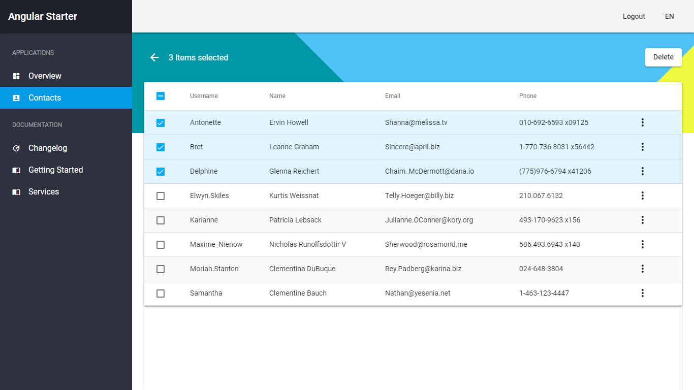

<p align="center">
  
  <br />
  <p align="center">
  Angular 8, NgRx and Angular Material Starter
  <br /><br />

  <a href="https://circleci.com/gh/truonghungit/angular-starter">
    
  </a>
  <a href="https://github.com/prettier/prettier">
    
  </a>
  <a href="https://github.com/truonghungit/angular-starter/commits">
    
  </a>
  </p>

  
  
</p>

---


## Table of Content

- [Live Demo](https://angular-starter.firebaseapp.com/)
- [Getting Started](#getting-started)

## Getting started

```bash
git clone https://github.com/truonghungit/angular-starter.git new-project
cd new-project
npm install
npm start
```

## Development server

Run `ng serve` for a dev server. Navigate to `http://localhost:4200/`. The app will automatically reload if you change any of the source files.

## Code scaffolding

Run `ng generate component component-name` to generate a new component. You can also use `ng generate directive|pipe|service|class|guard|interface|enum|module`.

## Build

Run `ng build` to build the project. The build artifacts will be stored in the `dist/` directory. Use the `--prod` flag for a production build.

## Running unit tests

Run `ng test` to execute the unit tests via [Karma](https://karma-runner.github.io).

## Running end-to-end tests

Run `ng e2e` to execute the end-to-end tests via [Protractor](http://www.protractortest.org/).

## Further help

To get more help on the Angular CLI use `ng help` or go check out the [Angular CLI README](https://github.com/angular/angular-cli/blob/master/README.md).

##  Why do I need Storybook

There are many use cases for Storybook: 
- a component explorer
- styleguide
- UI docs
- playground
- sandbox
- workshop
- library

## JSON Server

```bash
cd server
npm install
npm start
```
